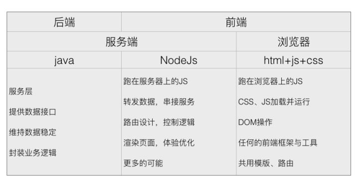

# node

* 不是语言
* 服务端的JavaScript
* 运行在服务端的开发运行平台
* 基于v8引擎封装
* 不会成为一个独立的服务端
* 主要作为一个中间层，小型服务、作为一个工具使用

## 优势

* 便于前端工程师使用 
* 性能出众

  node不会为每一个客户创建一个线程--8G的可以同时处理4万的访问--坏处--当一个用户出现问题后，服务会当掉
java等后台会给每一个创建接近2M的一个内存--8G可以同时处理4千的访问

* 利于前端代码整合
* 基于事件驱动, 天生异步（基于JavaScript）

  node不会因为IO（读写）的操作不会阻塞程序的执行

## node中间层的作用

> 是一种开发模型

* 处理跨域
* 安全（防止获取后台的ip)
* 性能

  减少因为服务器端返回数值不理想在浏览器端重新计算问题

* SEO和首屏加载，可以在服务器端直接针对页面进行html字符串拼接后返回，减少了浏览器的计算，而只注重渲染。
* 批量数据

  当数据量大，并且来源不同的接口（淘宝）
  解决方案：合并请求、分批输出

