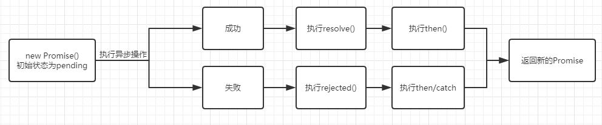

# 是什么

1. 是一个构造函数
2. 是通过Promise对象封装的一个异步操作并获取其结果

# 状态

1. 初始为pending状态
2. 可以变成 resolved（成功） 或者 rejected（失败）
3. 且一个promise状态只可改变一次

# 流程



# API

## 构造函数 Promise(excutor){}

> excutor会在Promise内部立即同步执行，异步操作在执行器中执行

1. excutor函数： 执行器（resolve，reject） => {}
2. resolve函数： 成功的回调函数---------(执行zhen方法)
3. reject函数： 内部定义失败的回调函数---（执行zhen或者catch方法）

``` JS
new Promise((resolve, rejected) => {
    if('执行成功') {
        resolve('data')
    } else {
        rejected('error')
    }
})
```

## 静态方法 Promise.resolve(data)

> 返回成功值为 data 的 Promise 对象

``` JS
const p = Promise.resolve(1) // p.then(v => {console.log(v)})   ===> 1
```

## 静态方法 Promise.reject(data)

> 返回失败值为 data 的 Promise 对象

``` JS
const p = Promise.resolve(1) // p.catch(v => {console.log(v)})   ===> 1
```

## 静态方法 Promise.all([p1, p2, p3])

> 通过数组执行多个 Promise 对象（当一个失败，会导致所有的失败）

``` JS
const pAll = Promise.all([p1, p2, p3])

pAll.then(
    values => {
        // values   ===>   [p1, p2, p3]
    }
)
```

## 静态方法 Promise.race([p1, p2, p3])

> 通过数组执行多个 Promise 对象（只要有一个完成或者失败就会执行then方法，其他的 Promise 就会关闭）

``` JS
const promise1 = new Promise(function(resolve, reject) {
    setTimeout(resolve, 500, 'one');
});

const promise2 = new Promise(function(resolve, reject) {
    setTimeout(resolve, 100, 'two');
});

Promise.race([promise1, promise2]).then(function(value) {
  console.log(value);
})
```

## 静态方法 Promise.allSettled([p1, p2, p3])

> 返回给定的 Promise 数组的状态值
