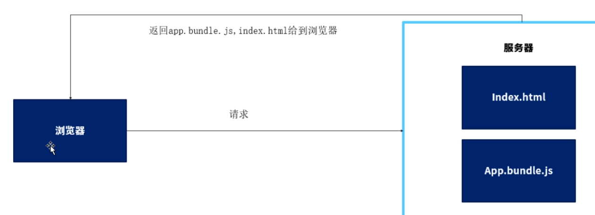
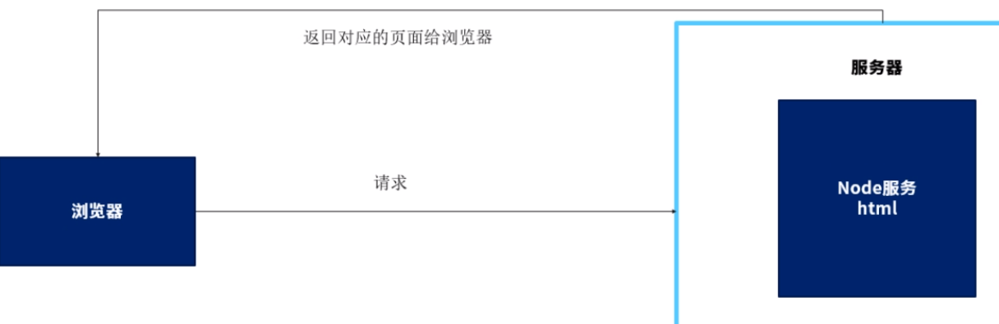

# ssr

## 产生的原因

* 当浏览器被访问的时候，会先从服务器端获取到静态的js和html文件，在浏览器内部进行代码执行和渲染
* 当seo（搜索引擎查看）执行过慢，位置偏低

## 原理
当浏览器被访问的时候，会先请求服务器上的node服务，node会进行分析访问的是哪个页面，直接将渲染好的页面返回给浏览器，减少浏览器对js执行的时间

- 浏览器
  
- node
  

## vue核心库
vue vue-server-render

