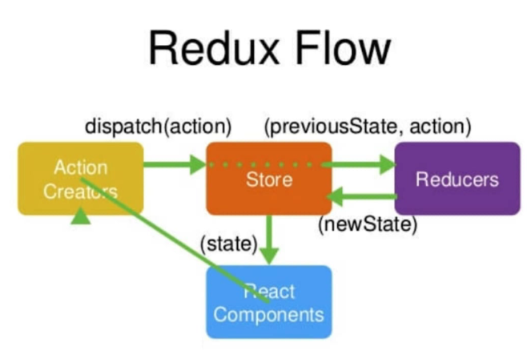

# 响应式设计思想

> 通过操作数据影响到页面上的显示

通过this.state存储数据，可以在render函数中通过{this.state.xxx}的形式调用值

事件的调用：通过在class中写函数的形式在render函数中{this.xxx.bind(this)}的方式进行调用
必须添加.bind(this)，因为在函数执行的时候this被指向为null

数据的更改，数据不可以通过this.state.xxx=xxx进行修改，需要通过this.setState({})进行更改

不要直接对state进行操作，如果是一个数组可以先拷贝后再进行修改，方便后期进行性能优化

# jsx

``` HTML
<!-- 双向绑定 -->
<input value={this.state.inputValue} />
<!-- 绑定事件(跟原生事件相似，只是改变了其中一个字母的大小写) -->
<button onClick={this.handleBtnClick.bind(this)}></button>
<!-- 循环 -->
<ul>
  <!-- { 
  this.state.list.map((item,index) => {
    return (
      <li
        key={index}
        onClick={this.handleItemDelete.bind(this)}
      >
        {item}
      </li>
    )
  })
} -->
</ul>
<!-- 添加class -->
<input className='input' />
```

# 组件传值和通信

> 子组件只可以使用父组件的值，不可更改父组件的值

## 传值

``` HTML
<!-- 父组件 -->
<TodeItem content={item} />
<!-- 子组件 -->
<div>{this.props.content}</div>
```

## 通讯

``` HTML
<!-- 子组件执行父组件方法 -->
<!-- 父组件 -->
<TodeItem handleClick={this.handleClick}} />
<!-- 子组件 -->
<div onClick={this.props.handleClick.bind(this)}></div>
```

# PropTypes

定义由父组件传递给子组件的类型

没有传值则不会进行类型校验，如果加上 isRequired 则会进行类型校验

``` JS
TodoItem.propTypes = {
  test: PropTypes.string.isRequired
  content: PropTypes.string,
  deleteItem: PropTypes.func,
  index: PropTypes.number
}
```

# defaultProps

父组件传递给子组件时的默认值

``` JS
TodeItem.defaultProps = {
  test: 'test1'
}
```

# Props、State与render函数

state在constructor中声明

在render函数中使用，当在render中发生变化时通过setState方法更改组件的state值

当state或props 发生变化的时候，render函数会被重新执行

# React中的虚拟dom

JSX -> React.createElement -> 虚拟DOM（JS对象） -> 真实DOM

组件初始化到变化

1. 生成state数据
2. 根据jsx生成模板dom
3. 数据+dom生成虚拟DOM（一个对象，用来描述真实DOM）
4. 当组件被访问的时候用虚拟DOM的结构生成真实的DOM
5. state中的数据发生改变
6. 数据 + 模板生成新的虚拟DOM（提升性能）
7. 根据diff算法比虚拟DOM中的变化
8. 根据变化进行局部DOM变化

优点

1. 性能提升
2. 使跨端应用的实现

# React的生命周期

> 生命周期函数是指某一个时刻组件会自动调用执行的函数

* constructor： 组件被创建的时候被调用
* render函数：组件初始化或者数据更新时被调用

1. Initialization（初始化）

   1. 数据初始化（初始化state和props）

2. Mounting（组件挂载）

   1.componentWillMount（在组件即将被挂载到页面上执行）
   2.render函数
   3.componentDidMount（组件被挂载到页面上后被执行）

3. Updation（组件更新）

   1. Props

      1. ComponentWillReceiveProps

         1. 子组件从父组件接受函数
         2. 父组件的render函数被执行，子组件的该函数被执行
         3. 组件第一次放入父组件时不会执行
         4. 如果组件之前已经存在于父组件中，才会执行

      2. 执行states的变化

   2.states

      1. shouldComponentUpdate（组件被更新之前执行, 判断是否需要更新，默认返回true）
      2. componentWillUpdate（组件确认被更新后，组件更新执行）
      3. 执行render函数
      4. componentDidUpdate（组件更新后被执行）
4. Unmounting（卸载）

   1. ComponentWillUnmount（在卸载之前被执行）

# Redux（数据层框架）


将数据存放到公共的store中，当store中的数据发生改变会影响到其他组件的绘制

## 相关知识点

* Redux中的store是唯一的
* store中的数据只有自己可以改变
* Reducer必须是纯函数

### store相关API

* dispatch: 发起数据更新操作
* getState：获取公共的store数据
* subscribe：当Redux中的数据发生改变就会触发该函数中传入的函数

## Redux工作流程



* store：存储数据的公共区域（图书馆管理员）
* React Component：React的每个组件（借书的用户）
* Action Creaturs：数据的传递（表达要借那本树）
* Reducers：存储目录（图书记录本）

## 使用

``` JS
/************reducer.js****************/
// 定义默认值（初始化图书馆中的书籍信息）
const defaultState = {
  inputValue: ''
}
// state: 存储的所有数据
// actrion：更改store执行的动作通过 store.dispatch 进行提交
export default (state = defaultState, action) => {
  if (action.type === 'change_input_value') {
    const newState = JSON.parse(JSON.stringify(state))
    newState.inputValue = action.value
    return newState
  }
  return state
}
/************store.js******************/
import {
  createStore
} from 'redux'
import reducer from './reducer'
const store = createStore(reducer)
export default store
/************component******************/
import store from './store'
// 获取
store.getState()
// 组件更改
class Component {
  constructor() {
    this.store = store.getState()
    store.subscribe(this.handleStoreChange)
  }
  handleInputChange(e) {
    const action = {
      type: 'change_input_value',
      value: e.target.value
    }
    store.dispatch(action)
  }
  handleStoreChange() {
    this.state(store.getState())
  }
}
```

## 通过actionCreator同一管理action

``` JS
export const getInputChangeAction = (value) => ({
  type: 'change_input_value',
  value
})
```

# UI组件和容器组件拆分

## UI组件

> 负责渲染

``` JS
import './Header.css'
import React from 'react'
import Header from './Header'

class HeaderUI extends Header {

  render() {
    const {
      addTodoListItem,
      changeValue
    } = this
    // return (
    //   <div className="Header-bg">
    //     <input
    //       value={this.state.inputValue}
    //       onChange={changeValue}
    //       ref={(input) => { this.input = input }}
    //     />
    //     <button onClick={addTodoListItem}>添加</button>
    //   </div>
    // )
  }
}

export default HeaderUI
```

## 容器组件

> 负责逻辑处理

``` JS
import React from 'react'
import {
  bindToThis
} from './util'

class Header extends React.Component {

  constructor(props) {
    super(props)
    this.state = {
      inputValue: ''
    }
    bindToThis.call(this, ['addTodoListItem', 'changeValue'])
  }

  addTodoListItem() {
    const {
      inputValue
    } = this.state
    this.props.addTodoListItem(inputValue)
  }
  changeValue(e) {
    const value = e.target.value
    this.setState(() => ({
      inputValue: value
    }))
  }
}

export default Header
```

# Redux-thunk

``` JS
/***********store/index.js*************/
// 先将applyMiddleware从redux中引入到store中
import {
  createStore,
  applyMiddleware
} from 'redux'
import reducer from './reducer'
import thunk from 'redux-thunk'
const store = createStore(reducer, applyMiddleware(thunk))
export default store
// 组件更改
class Component {
  constructor() {
    this.store = store.getState()
    store.subscribe(this.handleStoreChange)
  }
  handleInputChange(e) {
    const action = () => {
      return (dispatch) => {
        axios.get('./list.json').then(res => {
          const data = res.data
          const action = initListAction(data)
          dispatch(action)
        })
      }
    }
    store.dispatch(action)
  }
}
```

# Redux中间件

> 在action和store中间

## Redux数据流

1. view派发一个action给Redux
2. action通过actionCreator同一管理action丰富action
3. 将action分发给Dispatch
4. 如果存在中间件
5. dispatch将action分发给Reducer
6. Reducer复制一份State后更改需要更改的状态
7. 将新的State给Store触发视图的更改


# React-redux

> 将react和store链接

## 顺序

1. 将React-redux中的 Provider组件放入到顶级组件的上方
2. 在组件中通过React-redux中的connect进行链接
3. 将store中的数据映射到组件的props中
4. 当组件执行函数时
5. 先将store中的dispatch挂载到props中
6. 通过调用mapDispatchToProps函数return出的对象中的函数

``` JS
import React from 'react';
import ReactDOM from 'react-dom';
import TodeList from './TodeList';
import {
  Provider
} from 'react-redux'
import store from './store'

const App = (
  // 将store和react中进行链接
  // 这样在Provider组件的子组件都可以获取到store
  // <Provider store={store}>
  //   <TodeList/>
  // </ Provider>
)

ReactDOM.render(App, document.getElementById('root'));

// 组件更改
import {
  connect
} from 'react-redux'
class Component {
  handleInputChange(e) {
    const action = () => {
      return (dispatch) => {
        axios.get('./list.json').then(res => {
          const data = res.data
          const action = initListAction(data)
          dispatch(action)
        })
      }
    }
    store.dispatch(action)
  }
}
// 将store中的数据映射到props中
const mapStateToProps = (state) => {
  return {
    inputValue: state.inputValue
  }
}
// 将store中的dispatch映射到props上
const mapDispatchToProps = (dispatch) => {
  return {
    changeInputValue() {
      const action = initListAction(data)
      dispatch(action)
    }
  }
}
// 让组件和store链接
/**
 * mapStateToProps: 链接store中的数据
 * mapDispatchToProps: 链接store的dispatch
 */
export default connect(mapStateToProps, mapDispatchToProps)(Component)
```

# style-components

``` JS
import styled from 'style-components'
import logoPic from '../../logo.png'
// 全局样式
styled.injectGlobal `
  body {
    margin: 0;
    padding: 0;
    font-family: sans-serif;
  }`
// 创建一个组件HeaderWrapper里面包含一个div标签
const HeaderWrapper = styled.div `
  height: 56px;
  background: red
`
const Logo = styled.a `
  background: url(${logoPic})
`
```

# immutable.js

> 将一个js对象转换为不可改变的对象

set方法：会结合之前的imutabble对象的值和设置的值，返回一个全新的对象

``` JS
import {
  fromJS
} from 'immutable'

const defaultState = fromJS({
  inputValue: ''
})
export default (state = defaultState, action) => {
  if (action.type === 'change_input_value') {
    return state.set('inputValue', action.value)
  }
  return state
}
// 组件更改
import {
  connect
} from 'react-redux'
class Component {}
// 将store中的数据映射到props中
const mapStateToProps = (state) => {
  return {
    inputValue: state.get('inputValue')
  }
}
export default connect(mapStateToProps, mapDispatchToProps)(Component)
```

# 路由

安装react-router-dom

``` JS
import {
  BrowserRouter,
  Route
} from 'react-router-dom'

class App extends Component {
  render() {
    return (
      // <Provider store={store}>
      //   <div>
      //     <Header/>
      //     <BrowserRouter>
      //       <div>
      //         /*
      //         * path: 匹配的路径
      //         * exact: 要求完全匹配
      //         * component: 渲染组件
      //         */
      //         <Route path='/' exact component={Home}></Route>
      //         <Route path='/detail' exact component={Detail}></Route>
      //       </div>
      //     </BrowserRouter>
      //   </div>
      // </Provider>
    )
  }
}
```

# react-loadable

> 将组件封装成异步组件

``` JS
import React from 'react'
import Loadable from 'react-loadable'

const LoadableComponent = Loadable({
  loader: () => import('./component'),
  loading: () => {
    return '加载中显示的组件'
  }
})

export default () => < LoadableComponent / >
```

