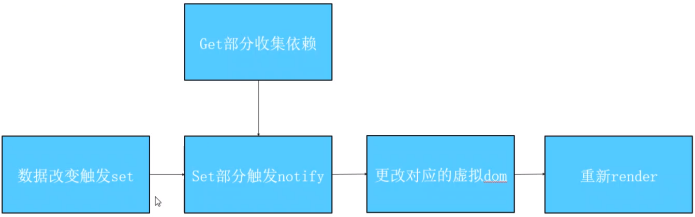

# defineProerty和Proxy的区别

	defineProerty会直接修改源对象的属性，Proxy则是将源对象copy一份后修改copy后对象
	Proxy是代理整个对象，defineProerty是劫持源对象中的某个属性值
	defineProerty的使用需要在外部定义一个变量，来保证get的返回

## defineProperty--劫持原对象，会直接修改源对象的属性

> defineProperty核心不是用于双向绑定的，而是是定义对象的属性，不过因为get和set所以可以较好的作为响应式的原理

* defineProperty详解

``` JS
var obj = {
  a: 1
}
Object.defineProperty(obj, 'a', {
  writable: false, // 是否可以被修改
  enumerable: false, // 是否可以被枚举
  configurable: false, // 是否可以被删除
  set: (newVal) => {}, // 更改值的时候被触发 newVal为最新值
  get: () => {} // get方法必须有一个return，但是需要借助外部变量

})
Object.freeze(obj) // 将对象的所有writable属性设置为false，包括子属性
Object.seal(obj) // 将对象的configurable设置为false，包括子属性
```

* vue 中从改变一个数据到发生改变的整个过程
  

- vue2双向绑定原理实现
``` JS

function vue() {
  this.$data = {
    a: 1
  }
  this.el = document.getElementById('app')
  this.virtualdom = ''
  this.observe(this.$data)
  this.render()
}
vue.prototype.observe = function(obj) {
  let self = this
  let value;
  for (let key in obj) {

    value = obj[key]
    if (typeof value === 'object') {
      this.observe(value)
    } else {
      Object.defineProperty(this.$data, key, {
        get: function() {
          return value
        },
        set: function(nv) {
          value = nv
        }
      })
    }

  }
}
vue.prototype.render = function() {
  console.log('刷新视图')
}
// vue数组监听实现
let arraypro = Array.prototype
let arrayob = Object.create(arraypro) // 深度拷贝一份，因为会修改原型链，防止原型链污染
let arr = ['push', 'pop', 'shift']
// 装饰者模式
arr.forEach(method => {
  arrayob[method] = function() {
    let ret = arraypro[method].apply(this, arguments) // 先执行原先的函数
    dep.notify() // 数据视图更新
    return ret

  }
})
```

## Proxy--代理

> 会保持源对象本身的情况，来改变返回的对象

``` JS
function vue() {
  this.$data = {
    a: 1
  }
  this.el = document.getElementById('app')
  this.virtualdom = ''
  this.observe(this.$data)
  this.render()
}
vue.prototype.observe = function(obj) {
  let self = this
  this.$data = new Proxy(this.$data, {
    get: function(target, key) {
      return Reflect.get(target, key)
    },
    set: function(target, key, value) {
      return Reflect.set(target, key, value)
    }
  })
}
vue.prototype.render = function() {
  console.log('刷新视图')
}
```

