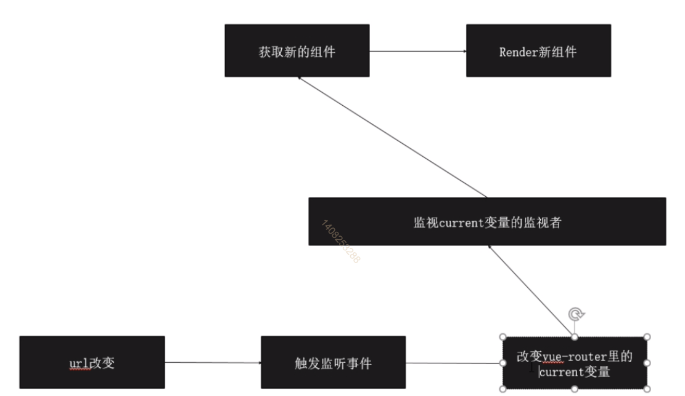

# 路由

  + 后端路由： 直接在地址上输入请求链接，将请求发送给后端，后端返回页面
  + 前端路由：通过#做区分，当链接发生改变的时候，通过js解析地址，生成页面

## vue-router原理图



## hash与history的使用

  + hash（路由变化是由前端控制的）
    - #后的是hash的内容
    - 可以通过location.hash拿到
    - 可以通过onhashchange监听hash的变化
  + history（请求会给到服务器）
    - history是正常的路径
    - location.pathname
    - 可以通过onpopstate监听history变化

# 路由原理的实现

``` JS
class HistoryRouter {
  constructor() {
    this.current = null
  }
}

class VueRouter {
  constructor(options) {
    this.mode = options.mode || 'hash'
    this.routes = options.routes
    this.routesMap = this.createRouteMap(this.routes)
    this.history = new HistoryRouter()
    this.init()
  }
  init() {
    if (this.mode === 'hash') {
      // 当输入网址时添加#
      location.hash ? '' : location.hash = '/';
      let sliceLocation = () => {
        // 因为携带的有#，要去掉
        this.history.current = loaction.hash.slice(1);
      }
      window.addEventListener('load', sliceLocation)
      window.addEventListener('hashchange', sliceLocation)
    }
  }
  // 创建路由的key
  createRouteMap(routes) {
    return routes.reduce((memo, current) => {
      memo[current.path] = current.component
      return memo
    }, {})
  }
}

VueRouter.install = function(vue) {
  // 单例模式： 防止组件重复注册
  if (VueRouter.install.installed) return
  VueRouter.install.installed = true

  vue.mixin({
    beforeCreate() {
      if (this.$options && this.$options.router) {
        // new vue 的时候被执行
        this._root = this
        this._router = this.$options.router
        vue.util.defineReactive(this, 'currnet', this._router.history)
        // 这样$router不可以被修改
        Object.defineProperty(this, "$router", {
          get() {
            return this._root._router
          }
        })
      } else {
        // 一直向上查找，查找到根目录的 new vue的实例里
        this._root = this.$parent._root
      }
    }
  })
  vue.component('router-view', {
    render(h) {
      let current = this._self._root._router.history.current
      let routerMap = this._self._root._router.routesMap
      return h(routerMap[current])
    }
  })
}

export default VueRouter
```

