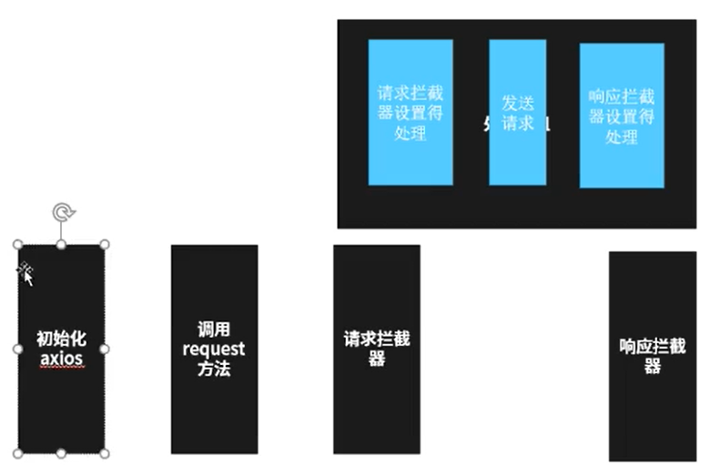

# 拦截

## 拦截流程图



## 实现

``` JS
function axios() {
  this.interceptors = {
    request: new interceptorsManner(),
    response: new interceptorsManner()
  }
}
axios.prototype.request = function() {
  // dispatchRequest就是发送请求
  let chain = [dispatchRequest, undefined]
  let promise = Promise.resolve(config)
  this.interceptors.request.handler.forEach(interceptor => {
    chain.unshift(interceptors.fulfilled, interceptors.rejected)
  })
  this.interceptors.request.handler.forEach(interceptor => {
    chain.push(interceptors.fulfilled, interceptors.rejected)
  })
  while (chain.length) {
    promise = promise.then(chain.shift(), chain.shift())
  }
  return promise
}

function interceptorsManner() {
  this.handler = [] // 存放use加入的回调函数
}
interceptorsManner.prototype.use = function(fulfilled, rejected) {
  this.handler.push({
    fulfilled,
    rejected
  })
}
```

