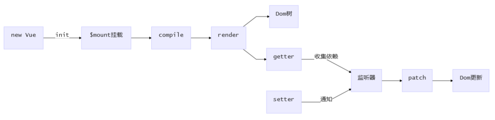
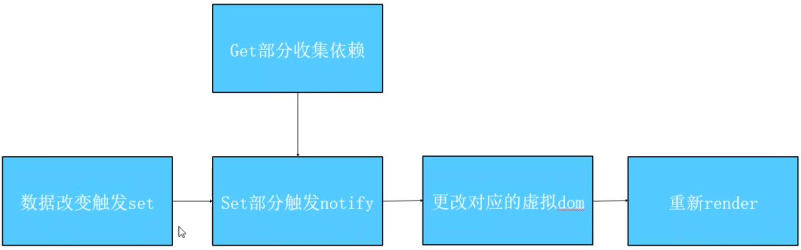
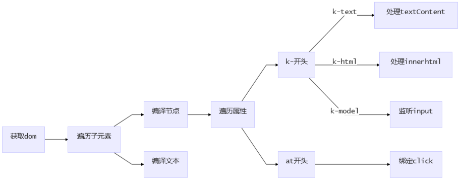

# vue工作机制

> 减少页面渲染的次数和数量

1. new Vue()
2. 通过init初始化（初始化生命周期、事件、props、methods、data、computed与watch。通过object.defineProperty 设置 setter 与 getter，来实现响应式和依赖收集）
3. 调用$mount挂载组件
4. 通过compile对模板中的html进行扫描（生成渲染树方便数据更新时进行diff算法比较进行最小更新）

   1.parse：使用正则解析template中的vue指令（v-xx、{{}}、@。。。）形成语法树
   2.optimize：标记一些静态节点，用作后面的性能优化，在diff的时候直接略过
   3.generate： 将第一部分生成的AST转化为渲染函数 render function

5. 通过watcher进行数据查看并更新



# 响应原理

## defineProerty和Proxy的区别

	defineProerty会直接修改源对象的属性，Proxy则是将源对象copy一份后修改copy后对象
	Proxy是代理整个对象，defineProerty是劫持源对象中的某个属性值
	defineProerty的使用需要在外部定义一个变量，来保证get的返回

## defineProperty--劫持原对象，会直接修改源对象的属性

> defineProperty核心不是用于双向绑定的，而是是定义对象的属性，不过因为get和set所以可以较好的作为响应式的原理

* defineProperty详解

``` JS
var obj = {
  a: 1
}
Object.defineProperty(obj, 'a', {
  writable: false, // 是否可以被修改
  enumerable: false, // 是否可以被枚举
  configurable: false, // 是否可以被删除
  set: (newVal) => {}, // 更改值的时候被触发 newVal为最新值
  get: () => {} // get方法必须有一个return，但是需要借助外部变量

})
Object.freeze(obj) // 将对象的所有writable属性设置为false，包括子属性
Object.seal(obj) // 将对象的configurable设置为false，包括子属性
```

* vue 中从改变一个数据到发生改变的整个过程

  

* vue2双向绑定原理实现

``` JS
function vue() {
  this.$data = {
    a: 1
  }
  this.el = document.getElementById('app')
  this.virtualdom = ''
  this.observe(this.$data)
  this.render()
}
vue.prototype.observe = function(obj) {
  let self = this
  let value;
  for (let key in obj) {

    value = obj[key]
    if (typeof value === 'object') {
      this.observe(value)
    } else {
      const dep = new Dep()
      Object.defineProperty(obj, key, {
        get: function() {
          // 添加依赖
          Dep.target && dep.addDep(Dep.target)
          return value
        },
        set: function(nv) {
          value = nv
          dep.notify() // 更新依赖
        }
      })
    }
  }
}
vue.prototype.render = function() {
  console.log('刷新视图')
}
// vue数组监听实现
let arraypro = Array.prototype
let arrayob = Object.create(arraypro) // 深度拷贝一份，因为会修改原型链，防止原型链污染
let arr = ['push', 'pop', 'shift']
// 装饰者模式
arr.forEach(method => {
  arrayob[method] = function() {
    let ret = arraypro[method].apply(this, arguments) // 先执行原先的函数
    dep.notify() // 数据视图更新
    return ret
  }
})
// Dep: 用来管理 Watcher（依赖）
function Dep() {
  this.deps = []
}
Dep.prototypt = {
  // 添加依赖
  addDep(dep) {
    this.deps.push(dep)
  },
  // 更新所有依赖
  notify() {
    this.deps.forEach(dep => dep.update())
  }
}

function Watcher() {
  // 将当前watcher的实例指向Dep静态属性target
  Dep.target = this
}
Watcher.prototype = {
  update() {}
}
```

## Proxy--代理

> 会保持源对象本身的情况，来改变返回的对象

``` JS
function vue() {
  this.$data = {
    a: 1
  }
  this.el = document.getElementById('app')
  this.virtualdom = ''
  this.observe(this.$data)
  this.render()
}
vue.prototype.observe = function(obj) {
  let self = this
  this.$data = new Proxy(this.$data, {
    get: function(target, key) {
      return Reflect.get(target, key)
    },
    set: function(target, key, value) {
      return Reflect.set(target, key, value)
    }
  })
}
vue.prototype.render = function() {
  console.log('刷新视图')
}
```

# compile（在vue初始化的时候被执行）

> 核心逻辑：获取dom、遍历dom、获取{{}}格式的变量，每个dom的属性（v-和@开头）



``` JS
function Compile(el, vm) {
  this.$el = el //要遍历的宿主节点
  this.$vm = vm
  // 编译
  if (this.$el) {
    // 将dom节点转换为fragment
    this.$fragment = this.node2Fragment(this.$el)
    // 执行编译
    this.compile(this.$fragment)
    // 将编译完的html结果追加到$el
    this.$el.appendChild(this.$fragment)
  }
}
Compile.prototype = {
  // 将宿主元素中的代码片段拿出来遍历，这样做比较高效
  node2Fragment(el) {
    const frag = document.createDocumentFragment()
    //将所有子元素搬家到frag中
    let child
    while (child = el.fristChild) {
      frag.appendChild(child)
    }
  },
  compile(el) {
    const childNodes = el.childNodes
    Array.from(childNodes).forEach(n => {
      // 类型判断
      if (this.isElement(n)) {
        // 查找v-、@、：（绑定）
        const nodeAttrs = noed.attributes
        Array.from(nodeAttrs).forEach(attr => {
          const attrName = attr.attrName
          const attrValue = attr.value
          if (this.isDirective(attrName)) {
            const dir = attrName.substring(2)
            if (this[dir]) this[dir](node, this.$vm, value)
          }
          if (this.isEvent(attrName)) {

          }
        })
      } else if (this.isInterpolation(n)) {
        this.compileText(n)
      }
      // 循环子节点
      if (n.childNodes && n.childNodes.length > 0) {
        this.compile(n.childNodes)
      }
    })
  },
  // 设置数据  RegExp.$1(获取刚匹配的内容)
  compileText(n) {
    n.textContent = this.$vm.$data[RegExp.$1]
  },
  text(node, vm, value) {
    this.update(node, vm, value, 'text')
  },
  // 更新函数
  update(node, vm, exp, dir) {
    const updateFn = this[dir + 'Update']
    // 初始化
    updateFn && updateFn(node, vm.$data[exp])
    // 收集依赖
    new Watcher(vm, exp, function(value) {
      updateFn && updateFn(node, value)
    })
  },
  textUpdate(node, value) {
    node.textContent = value
  }
  isElement(n) {
    return n.nodeType === 1
  },
  // 插值文本（  {{a}}   ）
  isInterpolation(n) {
    return n.nodeType === 3 && /\{\{(.*)\}\}/.test(n.textContent)
  },
  isDirective(attr) {
    return attr.indexof('v-') === '0'
  },
  isEvent(attr) {
    return attr.indexof('@') === '0'
  },
}
```

# vue编译过程是怎么样的

因为vue的模板不被浏览器识别，通过编译的过程可以进行依赖收集，可以在数据模型和视图模型产生联系，当数据产生变化的时候可以驱动视图的变化

