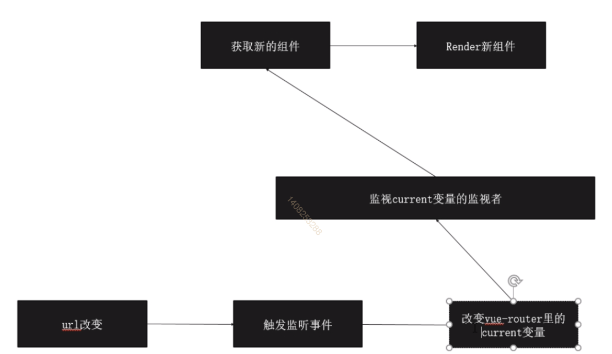

# 路由

  + 后端路由： 直接在地址上输入请求链接，将请求发送给后端，后端返回页面
  + 前端路由：通过#做区分，当链接发生改变的时候，通过js解析地址，生成页面

## vue-router原理图



## hash与history的使用

  + hash（路由变化是由前端控制的）
    - #后的是hash的内容
    - 可以通过location.hash拿到
    - 可以通过onhashchange监听hash的变化
  + history（请求会给到服务器）
    - history是正常的路径
    - location.pathname
    - 可以通过onpopstate监听history变化

# 路由原理的实现

``` JS
class HistoryRouter {
  constructor() {
    this.current = null
  }
}

class VueRouter {
  constructor(options) {
    this.mode = options.mode || 'hash'
    this.routes = options.routes
    this.routesMap = this.createRouteMap(this.routes)
    this.history = new HistoryRouter()
    this.init()
  }
  init() {
    if (this.mode === 'hash') {
      // 当输入网址时添加#
      location.hash ? '' : location.hash = '/';
      let sliceLocation = () => {
        // 因为携带的有#，要去掉
        this.history.current = loaction.hash.slice(1);
      }
      window.addEventListener('load', sliceLocation)
      window.addEventListener('hashchange', sliceLocation)
    }
  }
  // 创建路由的key
  createRouteMap(routes) {
    return routes.reduce((memo, current) => {
      memo[current.path] = current.component
      return memo
    }, {})
  }
}

VueRouter.install = function(vue) {
  // 单例模式： 防止组件重复注册
  if (VueRouter.install.installed) return
  VueRouter.install.installed = true

  vue.mixin({
    beforeCreate() {
      if (this.$options && this.$options.router) {
        // new vue 的时候被执行
        this._root = this
        this._router = this.$options.router
        vue.util.defineReactive(this, 'currnet', this._router.history)
        // 这样$router不可以被修改
        Object.defineProperty(this, "$router", {
          get() {
            return this._root._router
          }
        })
      } else {
        // 一直向上查找，查找到根目录的 new vue的实例里
        this._root = this.$parent._root
      }
    }
  })
  vue.component('router-view', {
    render(h) {
      let current = this._self._root._router.history.current
      let routerMap = this._self._root._router.routesMap
      return h(routerMap[current])
    }
  })
}

export default VueRouter
```

# vue路由配置

``` JS
const routes = [{
  path: '/:id', // 跳转路径（可以在后面添加id参数）
  redirect: '/a', // 重定向路径
  name: 'page', // 路由名称
  conponent: page, // 路由指向组件
  props: true, // 是否将id以props的形式在组件中使用
  children: [], // 子路由又叫嵌套路由
  beforeEnter: () => {} // 路由内守卫，当进入路由时执行该函数
}]
```

# path和fullpath区别

fullpath会携带请求的参数
path只是请求的路径

# router-view直接配置

需要在router文件中配置components

``` HTML
<router-view></router-view>
<router-view name="david"></router-view>
<router-view name="head"></router-view>
```

``` JS
const routes = [{
  path: '/:id', // 跳转路径（可以在后面添加id参数）
  conponent: {
    default: pageA
    david: test1,
    head: test2
  }, // 路由指向组件
}]
```

# 导航守卫

## 执行顺序

1. 导航被触发
2. 调用全局的beforeEach守卫
3. 在重用组件里调用beforeRouteUpdate守卫
4. 在路由配置中调用beforeEnter
5. 在激活的组件中调用beforeRouteEnter
6. 调用全局的beforeResolve守卫
7. 导航被确认
8. 调用全局的afterEach钩子
9. 触发DOM更新

## 全局守卫

``` JS
// 全局前置守卫：当导航触发时，全局前置守卫按照创建的顺序调用
//用于数据校验 if(to.fullpath === 'home'){ next('/login')}
router.beforeEach((to, from, next) => {})
// 全局解析守卫（2.5新增api）
// 和全局前置守卫区别：在导航被确认之前，同时在所有组件内守卫和异步路由组件被解析之后，解析守卫被调用
router.beforeResolve((to, from, next) => {})
// 全局后置守卫
router.afterEach((to, from) => {})
```

## 路由独享守卫

``` JS
// 写在配置中
const routes = [{
  path: '/:id', // 跳转路径（可以在后面添加id参数）
  conponent: page, // 路由指向组件
  beforeEnter: () => {} // 路由内守卫，当进入路由时执行该函数
}]
```

## 组件内守卫

``` JS
// 写在组件中（和mounted同级）
beforeRouteEnter(to, from, next) {
  // 渲染组件路由时被调用
  // 不能获取到组件的this，因为执行时组件实例没有被创建
  next()
}
beforeRouteUpdate(to, from, next) {
  // 当前路由改变，但是组件被复用时调用
  // 例如：/foo/:id的路由，在/foo/1和/foo/2之间跳转时该钩子被调用
  // 可以访问到this
}
beforeRouteLeave(to, from, next) {
  // 离开路由时被调用
  // 用来禁止当用户未保存就突然离开时，通过next(false)来取消
}
```

# 异步组件

通过webpack配合

``` JS
{
  path: '/login',
  conponent: () => import('./component/Login')
}
```

