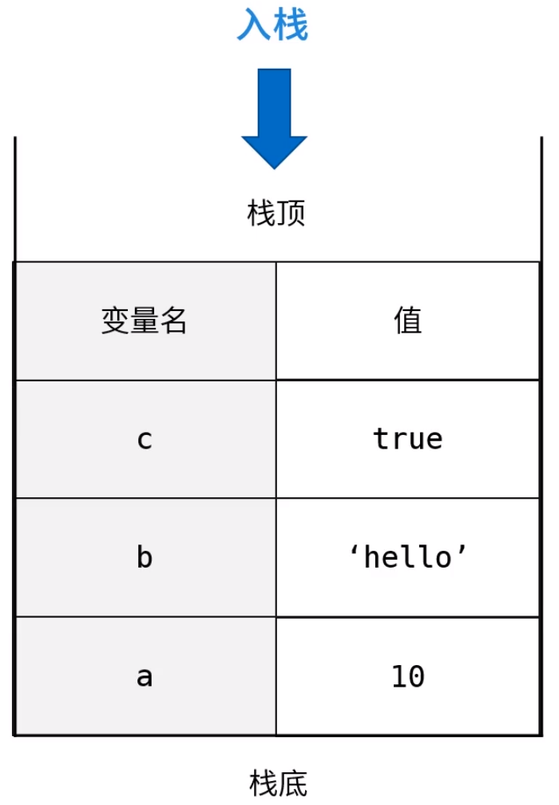
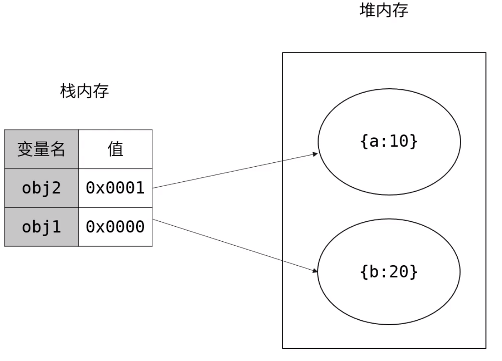
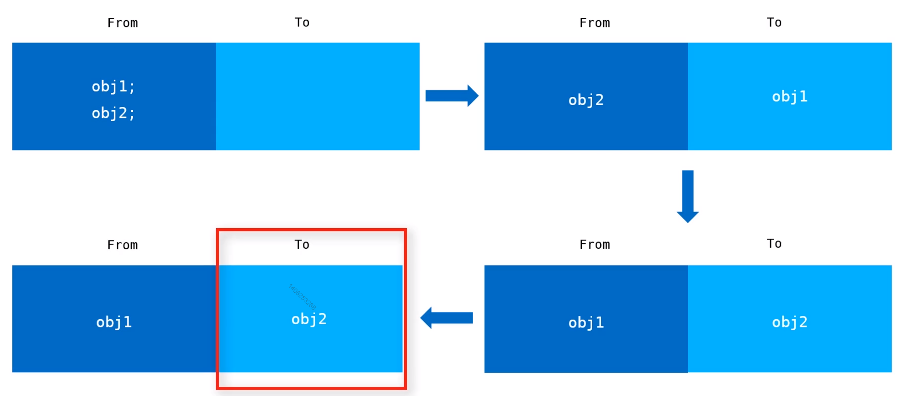
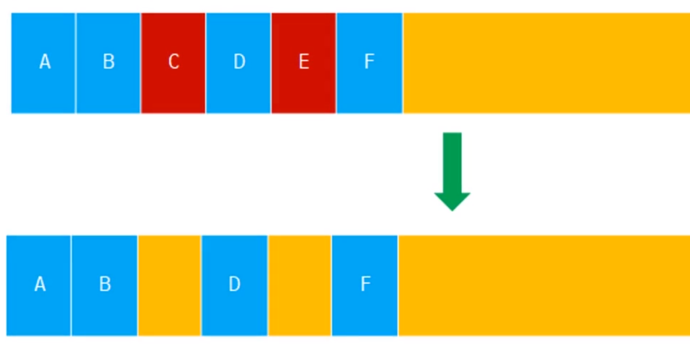
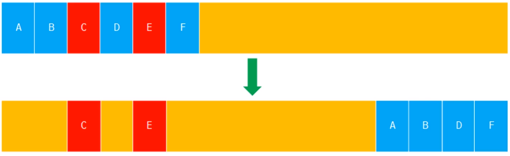

# 课程目标

* 为什么要关注内存
* JS数据类型和JS内存机制
* 垃圾回收
* V8内存的管理机制

## 为什么要关注内存

* 防止页面占用内存过大，引起客户端卡顿，页面无响应
* Node.js使用V8引擎，内存对于后端服务的性能更为重要，因为后端服务的持久性，后端更容易造成内存溢出

# 数据类型

1. 原始数据类型： 字符串（String）、数字（Number）、布尔（Boolean）、空对象（null）、未定义（Undefined）、Symbol（代表数据唯一）
2. 引用数据类型：Object（array也是属于对象）
3. 内存空间：栈内存（stack）、堆内存（heap）

**<font color='red'>原始数据类型存储在栈内存中</font>**

``` 
  当原始数据被声明的时候会根据声明的前后顺序从栈顶入栈，一直到栈底
  存储的时候是值先被存储，后声明一个变量指向之前的值

  出栈的顺序为先进后出
```



**<font color='red'>引用数据类型存储在堆内存中</font>**

``` 
当存储的时候，会现在堆内存中开辟一块空间，以键值对的形式存储，同时生成了一个16进制的内存地址，同时在栈内存中存储一个值为内存地址的数据
```



# 垃圾回收

## JavaScript垃圾回收机制

> 找出不再继续使用的变量，然后释放其所占用的内存，垃圾回收器会按照固定的时间间隔周期性的执行此操作

* 利

``` 
可以大幅度简化程序内存管理代码，降低程序员的负担，减少因长时间运转带来的内存泄露
```

* 弊

``` 
程序员无法掌握内存，无法强迫进行垃圾回收，更无法干预内存管理
```

## 垃圾回收策略

1. 引用计数(IE8 之前使用)

  每次引用加一，每次释放减一，当这个值的引用次数变成0的时候，可以将内存空间回收
  当出现循环调用时
  

``` JavaScript
  let objA = {},
      objB = {}
  objA.c = objA
  objB.d = objB
```

2. 标记清除（主流浏览器现在使用，收集的间隔不同）

  当变量进入环境时，变量被标记为进入环境，当变量离开环境的时候被标记为离开环境，垃圾回收器销毁那些带标记的值并回收内存空间

  

``` javaScript
  function foo() {
      var a = 10 // 被标记进入环境
      var b = 'hello' // 被标记进入环境
  }
  foo() // 执行完毕，a 和 b 被标记离开环境， 垃圾回收
```

  + 执行环境

    执行环境定义了变量或函数有权访问的其他数据，每个环境都有一个与之关联的变量对象，环境中定义的所有变量都保存在这个对象中

    - 全局执行环境
      1. 最外围的执行环境
      2. 根据宿主环境不同，执行环境的对象也不同（浏览器--window，node--gloab）
      3. 全局变量和函数都是作为window对象的属性和方法创建的
      4. 环境被销毁，则其中的所有变量和函数都被销毁
    - 环境栈（局部）

      每个函数都有自己的执行环境，当执行流进入一个函数时，函数的环境会被推入到环境栈中，当执行过后栈将其弹出，把控制权返还给之前的执行环境

## v8

### 限制内存原因

> node中可以使用buffer操作大内存的内容，因为buffer是受c++控制的

* 最初为浏览器设计，不太可能遇见大量内存的使用场景
* 防止因为内存回收导致线程暂停执行的时间过长

### 回收策略

* V8采用分代回收的策略，将内存分为新生代和老生代

  + 新生代（存放存活时间较短的对象）

    针对将存放的堆空间一分为二（使用中的空间为from空间，闲置的空间属于to空间）在分配空间的时候现在from空间中分配

    将from中存活的对象先复制到to空间==》将from空间和to空间进行互换==》释放to空间的内存

    **<font color='red'>当一个对象被复制多次后依然存活，会被移动到老生代，如果在反转的过程中，to空间的使用量超过了25%，那么将from中的对象转移到老生代中</font>**

    

  + 老生代（存放存活时间较长的对象）

    > 老生代内存空间是一个连续的结构

    - 标记清除(垃圾回收后会产生内存不连续的情况)

      > 将需要被回收的对象标记为红色，在垃圾回收时释放相应的内存

      

    - 标记合并（颜色错误，红蓝相反）

      > 将活跃的对象移动到另一边，然后对需要回收的对象进行整体回收

      

* V8分别对新生代和老生代使用不同的垃圾回收算法来提升垃圾回收效率

