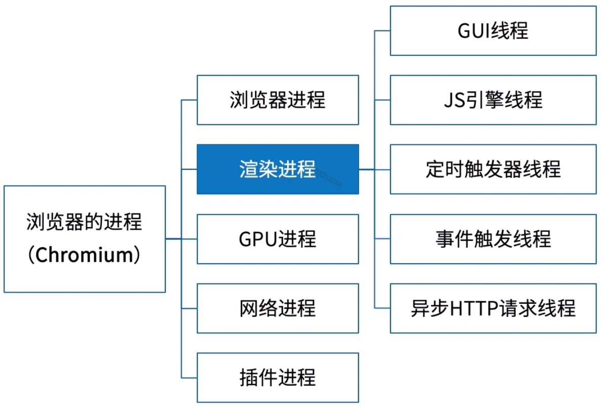

# 同步和异步

* 同步： 调用之后得到结果，再干其他任务
* 异步： 调用之后不管结果，继续干别的任务

# 进程和线程

> CPU为工厂、进程为车间、工人为线程

linux查看进程 ps(process status)、top(table of processes)

* 进程
  + 程序运行的实例
  + 同意程序可以产生多个线程
  + 一个进程包含一个或者多个线程
* 线程
  + 操作系统能够调度的最小单位
  + 一次只能执行一个任务
  + 有自己的调用栈、寄存器环境
  + 同一进程的线程贡献进程资源

- GUI线程：渲染布局
- JS引擎线程： 解析、执行JS（与GUI互斥线程）
- 定时器触发器线程： setTimeout、setInterval
- 事件触发线程：将满足条件的事件放入任务队列
- 异步 HTTP 请求线程： XHR（XMLHttpRequest） 所在的线程
