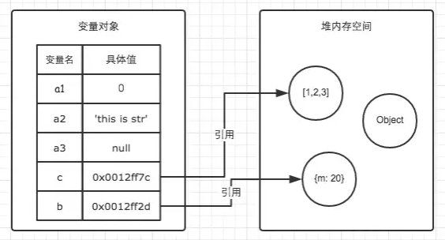
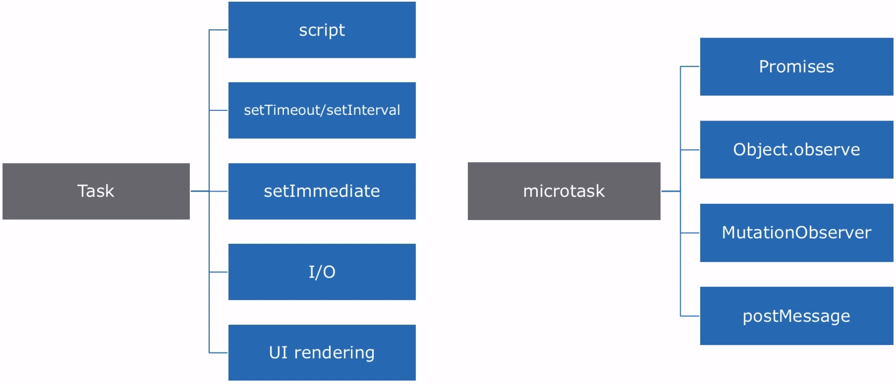
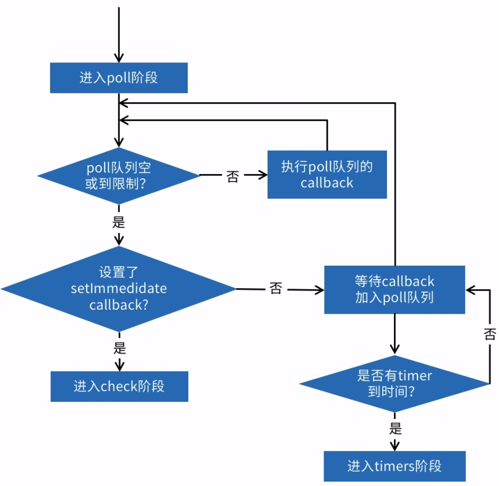

# 栈内存和堆内存

# 栈

> 闭包中的基本数据类型不保存在栈内存中，而是保存在堆内存中。

栈是一种后进先出的数据结构，基本数据类型保存在栈内存中

栈内存中的变量在执行环境结素和就会被销毁

# 堆

let a = {b: 1}

当访问引用数据类型时，先从栈中回去内存地址

栈中存储的是 a：0x0000001   由内存地址指向 {b：1}



堆内存中的变量只有在所有对它引用都结束的时候才会被回收

# Event Loop 机制（实现异步的机制）

## 微任务和宏任务



## 浏览器的 Event Loop

先微任务后宏任务

## Node.js 的 Event Loop

分为六个阶段

1. timers: 执行 timer（定时器） 的回调
2. pending callbacks: 系统操作的回调
3. idle,pepare: 内部使用
4. poll: 等待 I/O 事件
5. check: 执行 setimmediate 回调
6. close callbacks: 内部使用

每个阶段都有一个 callbacks 的先进先出队列需要执行。当 event loop 运行到一个指定阶段时，该阶段的 fifo 队列将会被执行，当队列 callback 执行完成或者执行的 callbacks 数量超过该阶段的上限时， event loop会转入下个阶段

### poll阶段

poll阶段主要有两个功能

* 计算应该被 block（等待 I/O 事件） 多久
* 处理 poll 队列的事件



``` JS
/**
* 先读取文件，使用4ms
* 进入回调队列，执行回调使用200ms
* 执行后查看没有回调等待，同时 timers 到时间
* 执行 timer
*/
const fs = require('fs')

function readFile(fn) {
  fs.readFile(__dirname, fn)
}
const now = Date.now()
setTimeout(() => {
  const delay = Date.now() - now
  console.log(delay)                // =====》 204ms
}, 100);
readFile(() => {
  const start = Date.now()
  while (Date.now() - start < 200 > ) {}
})
```

