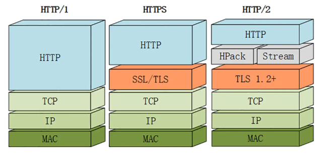

# HTTP的特点和缺点

## 特点

* 灵活可扩展（1. 只规定了基本格式，没有严格的语法限制。2. 可以传输除文本意外的内容）
* 可靠传输（因为是基于TCP/IP）
* 有请求有应答
* 无状态，每次http请求都是独立的

## 缺点

* 无状态，在长连接中，需要保存大量的上下文信息
* 明文传输：报文信息是以文本形式传输（方便调试，但是也给攻击者提供遍历）
* 对头阻塞：当长连接时，共用一个 TCP 连接，同一时刻只能处理一个请求，那么当前请求耗时过长的情况下，其它的请求只能处于阻塞状态，也就是著名的队头阻塞问题

# HTTP 报文结构

HTTP结构为 起始行 + 头部 + 空行 + 实体

## 起始行

> 在起始行中， 每两个部分之间用空格隔开，最后一个部分后面应该接一个换行

* 请求报文
  + 请求方法 + 请求路径 + http版本
* 响应报文
  + http版本 + 状态码 + 原因

## 头部

> Http报头分为通用报头，请求报头，响应报头和实体报头。

1. 字段名不区分大小写
2. 名称不允许出现空格，不可以出现下划线
3. 字段名称后要跟:

请求方的http报头结构：通用报头|请求报头|实体报头

响应方的http报头结构：通用报头|响应报头|实体报头

### 通用报头

通用头域包含Cache-Control、 Connection、Date、Pragma

* Cache-Control：指定请求和响应遵循的缓存机制
* Connection： 表示链接状态
* Date：表示消息发送时间
* Pragma：用来实现特定的指令

### 响应和请求报头

[git远程仓库版本回退.md](./HTTP头部字典.md)

## 空行

> 用来分割头部和实体

## 实体

就是具体的数据了，也就是body部分。请求报文对应请求体, 响应报文对应响应体。

# HTTP 请求方法

* GET: 用来获取资源
* HEAD： 获取资源元信息
* POST： 提交数据
* PUT： 修改数据
* DELETE： 删除数据
* CONNECT： 建立链接隧道，用于代理服务器
* OPTIONS： 列出可对资源实行的请求方法，用于跨域请求
* TRACE： 追踪请求-响应的传输路径

## GET和POST区别

* 缓存或者安全： GET请求会被浏览器主动缓存下来，其他人查看历史记录会看到提交的数据，另外get提交数据还可能会造成CSRF攻击。，POST不会
* 编码： GET只能进行URL编码，只能接受 ASCLL 字符，POST没有限制
* 参数： GET的参数一般放在 URL 中，POST 放在请求体中，更适合传输敏感信息
* TCP： GET请求会把请求报文一次发出去，POST会分为两个TCP数据包
* 用处： get常用于取回数据，post用于提交数据
* 请求参数： querystring 是url的一部分get、post都可以带上。get的querystring（仅支持urlencode编码），post的参数是放在body（支持多种编码）
* 请求参数长度限制： 因为URL是有长度限制的，所以get请求长度最多1024kb，POST 没有这个区别

# URI、URL和URN

URI（同一资源标识符）是标识资源位置（URL + URN = URI）
URL（同一资源定位符）用于定位资源位置
URN（同一资源命名）作为特定内容的唯一名称使用的，与当前资源的所在地无关。

# 定长包体和不定长包体

## 定长包体

通过 Content-length: number 设置长度，例如 helloworld 设置number为8 则传输时传输hellowor，设置number为10传输helloworld，设置12则报错

## 不定长包体

通过 Transfer-Encoding: chunked 实现，该字段会产生两个效果 1. 忽略 Content-length 字段。2. 可以用于长链接持续推送动态内容

可以通过不断的 res.write("传输内容"); 来让客户端接受信息

# HTTP/2

改进点

1. 头部压缩
2. 多路复用
3. 设置请求优先级
4. 服务器推送

## 头部压缩

采用 HPACK 算法对头部字段进行压缩

* 首先在服务端和客户端建立哈希表，将用到的字段放入表中，通过索引获取头名称
* 对整数和字符串进行哈夫曼编码（将出现的字符串建立一个索引表，然后在出现次数多的字符串对应的索引尽可能短）

## 多路复用

因为 HTTP 是基于 请求-响应的模型，在同一个长连接中，前一个没有响应，后面的请求就会阻塞

在 HTTP1 时 使用并发链接和域名分片解决，是通过增加了TCP链接，分摊风险，但是多条 TCP 链接会竞争有限带宽

### 二进制分帧

将现在的报文格式拆分成一个个二进制的帧，用 Headers 帧存放头部字段，Data 帧存放请求体数据

通过分帧，服务器看到的不再是完整的 HTTP 请求报文，而是二进制帧，这些帧不分先后，也就不会等待出现队头阻塞问题

## 服务器推送

之前服务器只能被动接受请求，在 HTTP/2 服务端可以通过 steam 来给客户端发送消息，当 TCP 链接建立之后。

比如浏览器请求一个 HTML 文件，服务器就可以在返回 HTML 的基础上，将 HTML 中引用到的其他资源文件一起返回给客户端，减少客户端的等待。

参考地址： https://juejin.im/post/5e76bd516fb9a07cce750746

