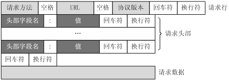
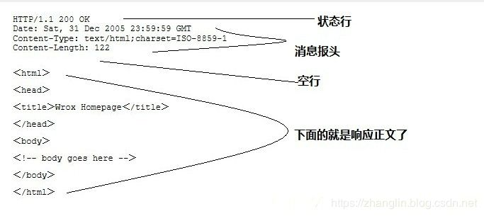

# 1.1 http的特点

* 基于tcp/ip、一种网络应用层协议、超文本传输协议HyperText Transfer Protocol
* 工作方式：客户端请求服务端应答的模式
* 快速：无状态连接
* 灵活：可以传输任意对象，对象类型由Content-Type标记
* 客户端请求request消息包括以下格式：请求行（request line）、请求头部（header）、空行、请求数据

  

* 服务端响应response也由四个部分组成，分别是：状态行、消息报头、空行、响应正文

  

# 1.2 请求方法

http请求可以使用多种请求方法。HTTP1.0定义了三种请求方法：GET, POST 和 HEAD方法。

HTTP1.1新增了五种请求方法：OPTIONS, PUT, DELETE, TRACE 和 CONNECT 方法。

1. GET 请求指定的页面信息，并返回实体主体。
2. HEAD 类似于get请求，只不过返回的响应中没有具体的内容，用于获取报头
3. POST 向指定资源提交数据进行处理请求（例如提交表单或者上传文件）。数据被包含在请求体中。POST请求可能会导致新的资源的建立和/或已有资源的修改。
4. PUT 从客户端向服务器传送的数据取代指定的文档的内容。
5. DELETE 请求服务器删除指定的页面。
6. CONNECT HTTP/1.1协议中预留给能够将连接改为管道方式的代理服务器。
7. OPTIONS 允许客户端查看服务器的性能。
8. TRACE 回显服务器收到的请求，主要用于测试或诊断。

## 常见的误区

### get和post误区

> 针对上面常见的区别，如果面试的时候这么说，肯定是有很大的毛病，刚在学校面试的时候也曾经囫囵吞枣地这样说过，现在回过头再想以前的错误认知，又有许多新的认识。

1. 误区一

> “用处：get常用于取回数据，post用于提交数据”

曾听到过这样一种说法：get替换post来优化网站性能，虽然这种说法没错，也的确get常被用于取回数据，但是post也被一些ui框架使用于取回数据，比如kendo ui中的grid，就是用post来接受数据的。所以结论是get、post用途也是因地制宜。如果你有使用过kendo UI，会发现分页、过滤、自定义的参数都包含在form data里面。

**请求参数**get是querystring（仅支持urlencode编码），post是放在body（支持多种编码） query参数是URL的一部分，而GET、POST等是请求方法的一种，不管是哪种请求方法，都必须有URL，而URL的query是可选的，可有可无。

1. 误区三

**“post比get安全性要高”**

这里的安全是相对性，并不是真正意义上的安全，通过get提交的数据都将显示到url上，页面会被浏览器缓存，其他人查看历史记录会看到提交的数据，而post不会。另外get提交数据还可能会造成CSRF攻击。
